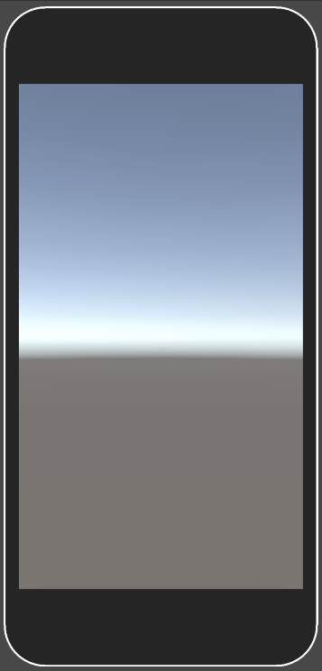
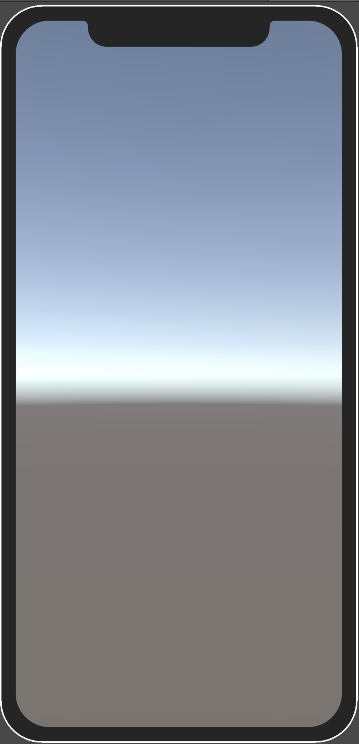

# Creating a device overlay

A device overlay is an image that contains the border of the device screen, together with notches, punchouts and any other additions to the screen rectangle. You can optionally use it with a device definition to visualise how hardware elements obstruct the device screen, and to determine when touch inputs will fail as a result.

| Apple iPhone 8 Overlay | Apple iPhone XS Overlay |
| --- | --- |
|  |  |

The texture that you use for a device overlay can be any shape. The screen area of the simulated device must be transparent, and the obstructed areas can be any color.

To display overlay in device simulator, path to overlay file and border size values must be added to device definition.

The path to the image file can be relative to the device definition, or relative from the folder that contains the **Assets** or **Packages** folders in your Unity project. For example, the following are both valid:

* Overlays/MinimalDeviceOverlay.png
* Assets/Devices/Overlays/MinimalDeviceOverlay.png

This is an example of a device definition that uses a device overlay:

```json
{
    "friendlyName": "Minimal Device with Overlay",
    "version": 1,
    "screens": [
        {
            "width": 1080,
            "height": 1920,
            "dpi": 450.0,
            "presentation": {
                "overlayPath": "Overlays/MinimalDeviceOverlay.png",
                "borderSize": {
                    "x": 51.0,
                    "y": 51.0,
                    "z": 51.0,
                    "w": 130.0
                }
            }
        }
    ],
    "systemInfo": {
        "operatingSystem": "Android"
    }
}
```
