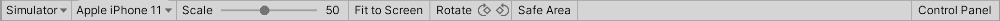
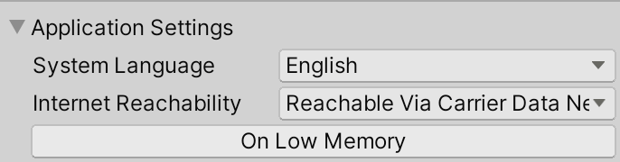

# The Device Simulator view

The Device Simulator view is part of the Device Simulator feature. It lets you view your application on a simulated mobile device. Use it to see how your application will appear with the screen shape, resolution and orientation of that device.

## Using the Device Simulator view

You can use the Device Simulator view in the following ways:

* In the Game view, in the top left corner, there is a drop-down menu. Use this to switch between the Game view and the Device Simulator view.
* Using the top menu, choose Window> General> Device Simulator

## Controls
### Toolbar

|**Control** |**Function** |
|:---|:---|
|Game/Simulator view| Use this drop-down menu to switch between the Device Simulator view and the Game view. |
|Device selection drop-down menu| Choose the device to simulate from the available [device definitions](DefiningCustomDevices.md). |
|Scale| Zoom in or out on the simulated screen. |
|Fit to Screen| Scale the display to fit inside the window. |
|Rotate| Simulates physical rotation of the device.  The picture on the device screen will rotate together with the device if the auto rotation is enabled and if the orientation is supported by the device. Otherwise rotating the device will cause the picture to be sideways or upside down.  **Note:** Gyroscope simulation is not supported by the Device Simulator. |
|Safe Area| Safe Area - toggle drawing a line around the SafeArea of the current device screen. |
|Control Panel| Show and hide the Control Panel. |

### Control Panel
By default, the Control Panel contains settings for the [Application simulated class](https://docs.unity3d.com/ScriptReference/Application.html). You can set the **System Language** and **Internet Reachability** values, and invoke the **Low Memory** event.

Device Simulator plugins can change the appearance of the control panel by adding content and controls. Some packages, like the [Adaptive Performance package](https://docs.unity3d.com/Packages/com.unity.adaptiveperformance@1.0/manual/index.html), contain Device Simulator plugins. Their UI will appear in the Control Panel when the package is installed. For more information, see [Device Simulator plugins](CreatingPlugin.md).

