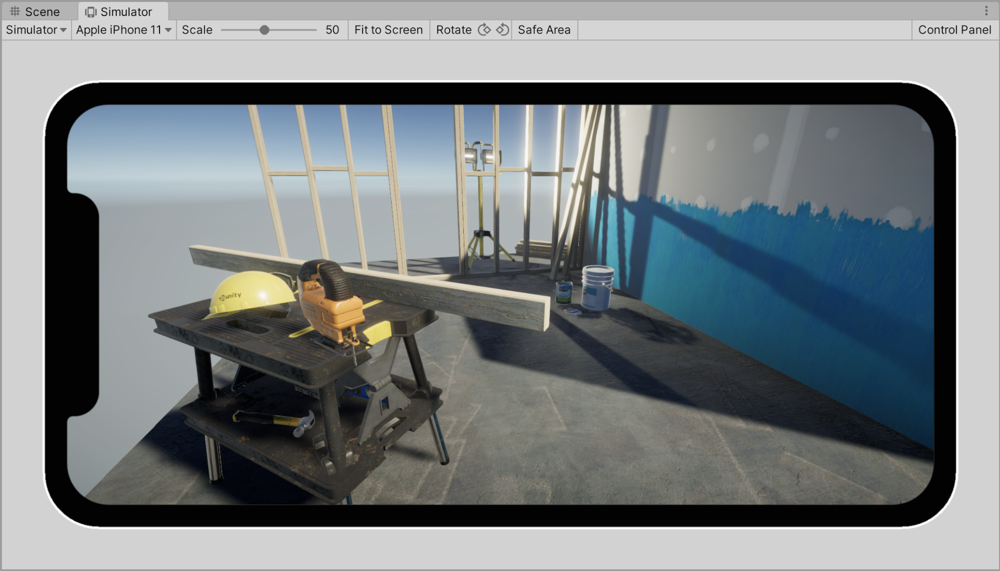

# Device Simulator

The **Device Simulator** is a Unity Editor feature that simulates how certain aspects of your application will appear and behave on a mobile device.

The Device Simulator consists of:

* The Device Simulator view, which lets you view your application on a simulated mobile device
* Simulated classes, which let you test code that responds to device-specific behaviors
* Device definitions, which describe the device to simulate
* Device Simulator plugins, which configure the UI of the Device Simulator view

# Device Simulator capabilities

## Controls in the Device Simulator view

The Device Simulator view simulates many common features of mobile devices, including:

* Auto-rotation
* Screen safe area
* Touch input

## Player Settings

Device Simulator reacts to some Player settings in the same way that a real device would. Supported Player settings are:

* FullScreen mode
* Resolution Scaling
* Default Orientation
* Graphics API

## Simulated touch input

Clicking on the simulated device screen with the mouse cursor will create touch events in the old Input Manager or the new Input System or both, depending on which one is active. Input is simulated only when the Editor is in play mode.

**Note:** Device Simulator does not support multitouch, only one finger touch is simulated.

## Limitations

The Device Simulator is intended primarily for viewing the layout of your application, and testing basic interactions. It does not provide an accurate representation of how your application will run on a device.

The Device Simulator view does not simulate the following:

* The performance characteristics of a device, such as processor speed, or available RAM.
* The rendering capabilities of a device.
* Native plugins that do not work in the Editor.
* Platform #define directives for the simulated device, like UNITY_IOS.
* Gyroscope rotation.

Additionally, not all APIs of the simulated classes are simulated.

# Document revision history
|Date|Reason|
|---|---|
|Apr 12, 2021|Matches package version 3.0.0-preview|
|Dec 2, 2019|Matches package version 2.0.0-preview|
|Nov 15, 2019|Matches package version 1.3.0-preview|
|Oct 11, 2019|Matches package version 1.2.0-preview|
|Sep 26, 2019|Matches package version 1.1.0-preview|
|Sep 23, 2019|Matches package version 1.0.0-preview|
